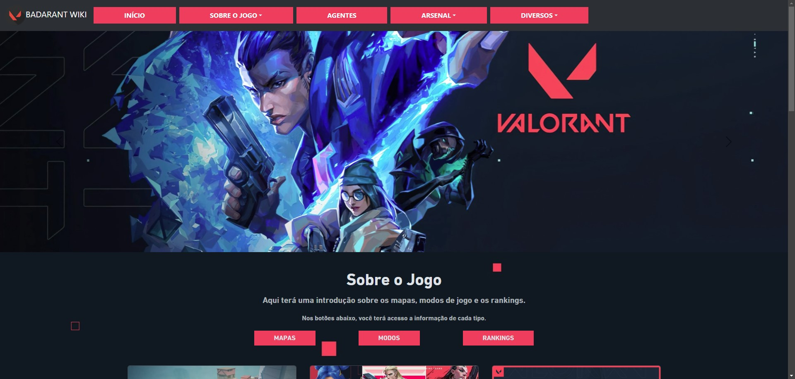

<h1 align="center">Badarant Wiki</h1>

##  Informações
Este projeto consiste em um Fansite do game Valorant e foi criado utilizando a plataforma Node.js com express.js. Está sendo consumido uma API externa do site <a href="https://valorant-api.com/">VALORANT API</a>.

##  Seções
- **Início**
- **Sobre o Jogo**
  - **Mapas**
  - **Modos de Jogo**
  - **Rankings**
- **Agentes**
- **Arsenal**
  - **Armas**
  - **Pacotes**
- **Diversos**
  - **Spray**
  - **Eventos**

##  Tecnologias utilizadas
- HTML5
- CSS3
- Bootstrap
- JavaScript
- Node.js
- Express.js
